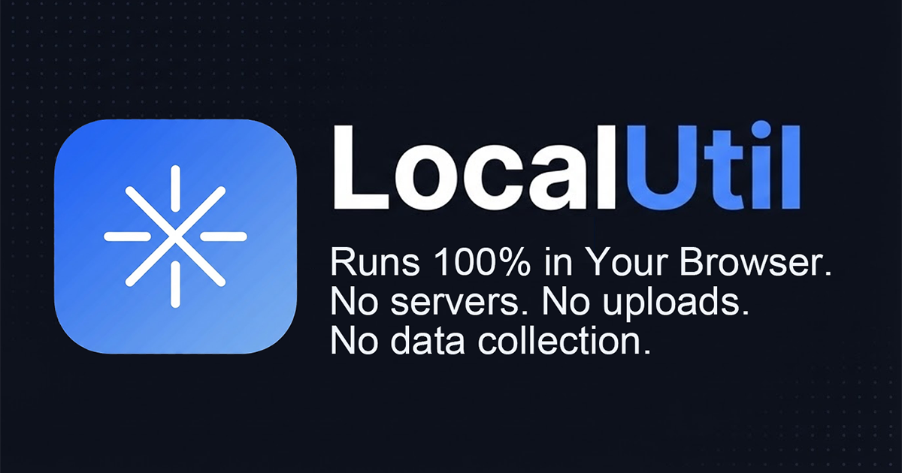

# LocalUtil

A collection of small, self-contained developer utilities that run entirely in the browser — no data ever leaves your machine. For personal use.

**Live:** https://jongsic.github.io/localutil/



## Tools

- **Encoding** — Base64, URL Encode/Decode, Hex/ASCII
- **Formatting** — JS Beautifier, JS Minify, Markdown Preview, JSON Formatter, CSV ⇄ Markdown
- **Crypto & Auth** — JWT Decode, GPG Key Inspector, Password Generator, Hash & HMAC, TOTP Generator, Passkey Debugger
- **Web3** — Ethereum ABI, HD Wallet Deriver
- **Utilities** — Epoch Converter, QR Generator, QR Reader, ICO Converter, GIF Studio, Image Resizer, SVG to Image, Diff/Compare, Regex Tester, Cron Parser, Telegram Bot Logger, SEO Checker

## How it works

Every tool is a standalone HTML file under [`public/`](public/) with its logic inline. `index.html` is the navigation entry point, `app.js` holds shared shell logic, and `styles.css` is the shared stylesheet. No build step, no framework — just static files.

## Local development

Open `public/index.html` in a browser, or serve the folder:

```sh
cd public && python3 -m http.server 8000
# → http://localhost:8000
```

## SEO metadata

Each page's `<title>`, meta description, OG tags, canonical URL, and JSON-LD — plus `sitemap.xml` and `robots.txt` — are generated by:

```sh
node scripts/gen-seo.mjs
```

Run it after adding or renaming a tool page, and add the new page's title/description to the `SEO` map at the top of that script (it warns about pages missing an entry).

## Localization

Pages are authored in English; other languages are applied at runtime by the i18n runtime in `app.js`. A per-language dictionary (`public/i18n/<code>.js`, English text as the key) is loaded on demand, applied to rendered text nodes and `placeholder`/`title`/`aria-label` attributes, and a MutationObserver re-applies it to anything page scripts render later — tool pages need no i18n markup at all. The language selector lives in the topbar; the choice persists in `localStorage` and the browser language is auto-detected on first visit. English is always the fallback for strings missing from a dictionary. SEO metadata stays English.

To add or update a language:

1. Extract the current UI strings: `node scripts/gen-i18n.mjs strings.json` (uses the test harness — run `cd test && npm run setup` once first).
2. Translate them into `public/i18n/<code>.js` following the format of `public/i18n/ko.js` (keys are the English strings, whitespace collapsed).
3. Register the language in the `LANGS` array in `public/app.js`.

Live values, code snippets, `<textarea>`/`<pre>`/`<code>` content and anything under a `data-i18n-skip` attribute are never translated.

## Deployment

Pushing to `main` triggers the [GitHub Pages workflow](.github/workflows/deploy.yml), which uploads `public/` and publishes it — no build required.

> One-time setup: **Settings → Pages → Build and deployment → Source: GitHub Actions**.

## Conventions

- Do not include `Co-Authored-By` trailers for AI tools in commit messages. Attribution should be limited to human contributors.
