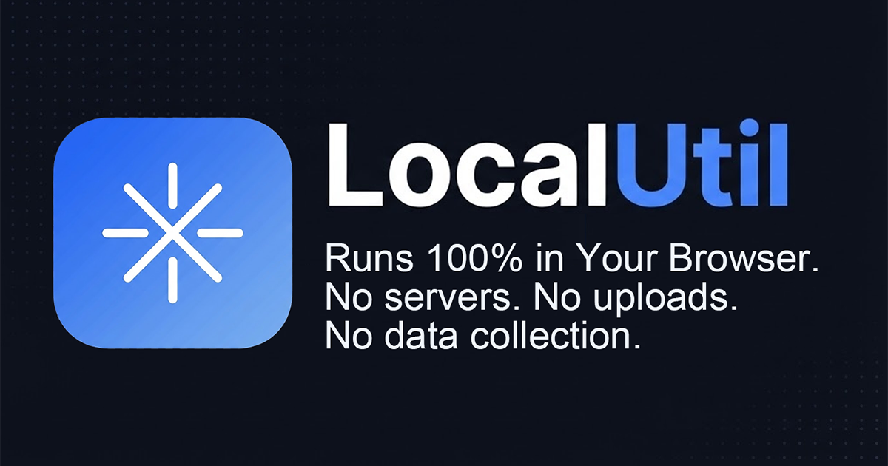

# LocalUtil

A collection of small, self-contained developer utilities that run entirely in the browser — no data ever leaves your machine. For personal use.

**Live:** https://jongsic.github.io/localutil/



## Tools

- **Encoding** — Base64, URL Encode/Decode, Hex/ASCII
- **Formatting** — JS Beautifier, JS Minify, Markdown Preview, JSON Formatter, CSV ⇄ Markdown
- **Crypto & Auth** — JWT Decode, GPG Key Inspector, SSH Key Converter, Keystore Inspector, Password Generator, Hash & HMAC, TOTP Generator, Passkey Debugger, Encrypt/Decrypt, Sign/Verify
- **Web3** — Ethereum ABI, HD Wallet Deriver
- **Utilities** — Epoch Converter, CIDR Calculator, QR Generator, QR Reader, ICO Converter, GIF Studio, Image Resizer, SVG to Image, Diff/Compare, Regex Tester, Cron Parser, Telegram Bot Logger, SEO Checker

## How it works

Every tool is a standalone HTML file under [`public/`](public/) with its logic inline. `index.html` is the navigation entry point, `app.js` holds shared shell logic, and `styles.css` is the shared stylesheet. No build step, no framework — just static files.

## Local development

Open `public/index.html` in a browser, or serve the folder:

```sh
cd public && python3 -m http.server 8000
# → http://localhost:8000
```

The Passkey, Encrypt and Sign tools need WebAuthn, which requires a secure context: `http://localhost` qualifies, `file://` does not. Open them through the server, not by double-clicking the file. Note that a WebAuthn credential is bound to the RP ID, so a credential (and anything encrypted with it) created on `localhost` will not work on the deployed site, and vice versa.

## SEO metadata

Each page's `<title>`, meta description, OG tags, canonical URL, and JSON-LD — plus `sitemap.xml` and `robots.txt` — are generated by:

```sh
node scripts/gen-seo.mjs
```

Run it after adding or renaming a tool page, and add the new page's title/description to the `SEO` map at the top of that script (it warns about pages missing an entry).

## Localization

Pages are authored in English; other languages are applied at runtime by the i18n runtime in `app.js`. A per-language dictionary (`public/i18n/<code>.js`, English text as the key) is loaded on demand, applied to rendered text nodes and `placeholder`/`title`/`aria-label` attributes, and a MutationObserver re-applies it to anything page scripts render later — tool pages need no i18n markup at all. The language selector lives in the topbar; the choice persists in `localStorage` and the browser language is auto-detected on first visit. English is always the fallback for strings missing from a dictionary. SEO metadata stays English.

To add or update a language:

1. Extract the current UI strings: `node scripts/gen-i18n.mjs strings.json` (uses the test harness — run `cd test && npm run setup` once first).
2. Translate them into `public/i18n/<code>.js` following the format of `public/i18n/ko.js` (keys are the English strings, whitespace collapsed).
3. Register the language in the `LANGS` array in `public/app.js`.

Live values, code snippets, `<textarea>`/`<pre>`/`<code>` content and anything under a `data-i18n-skip` attribute are never translated.

## Deployment

Pushing to `main` triggers the [GitHub Pages workflow](.github/workflows/deploy.yml), which uploads `public/` and publishes it — no build required.

> One-time setup: **Settings → Pages → Build and deployment → Source: GitHub Actions**.

## Encrypt / Sign — what is guaranteed, and what is not

These two tools do real cryptography, so it is worth being precise about what they promise. Everything below is enforced by tests in [`test/keysource.test.mjs`](test/keysource.test.mjs).

### Formats

**Signatures use standard formats only.**

| Source | Output | Spec |
|---|---|---|
| Private key (PEM) | Compact JWS — `ES256` / `ES384` / `ES512` / `EdDSA` / `RS256` | [RFC 7515](https://www.rfc-editor.org/rfc/rfc7515), [RFC 7518](https://www.rfc-editor.org/rfc/rfc7518), [RFC 8037](https://www.rfc-editor.org/rfc/rfc8037) |
| Shared key (≥32 bytes) | Compact JWS — `HS256` | RFC 7518 §3.2 |
| Security key | WebAuthn `AuthenticationResponseJSON` | [WebAuthn L3 §5.1](https://www.w3.org/TR/webauthn-3/#dictdef-authenticationresponsejson) |

A JWS whose payload happens to be JSON is also a valid JWT, and the JWT Decode tool on this site will read it. A JWS over arbitrary text is not a JWT — JWT requires a JSON payload.

**Encryption uses a format of its own, and that is a deliberate compromise.** The ciphertext is bare AES-256-GCM output with no header or marker, and the key-derivation parameters (`kdf`, `salt`, `iters`, `iv`, …) are returned separately as `name=value` lines to be exchanged out of band. No standard covers that split: JWE puts everything in one envelope, which is exactly what this avoids. The parameter format is therefore **non-standard and specific to this tool** — do not expect another implementation to read it. The primitives underneath are standard (PBKDF2-HMAC-SHA-256, HKDF-SHA-256, AES-256-GCM, RSA-OAEP-SHA-256, ECDH-ES).

### What holds

- **Whatever locks data unlocks it.** The key is derived from the source you pick; there is no second way in, and no wrapped copy of the key is attached. RSA-OAEP is the sole exception — it cannot agree on a key, only transport one — so that source alone publishes a wrapped content key.
- **Parameters are authenticated even though they travel separately.** They form the GCM additional data, built in a fixed field order with every name and value length-prefixed. Changing a value — lowering the PBKDF2 count, swapping a salt — makes decryption fail rather than silently weaken the result. Values are bound exactly as written, so re-padding a base64 value also fails; pass them through unaltered.
- **A verifier's key comes from the verifier.** Neither output format carries a public key, so verification is impossible without one being supplied. A signature that ships its own key proves the bytes are intact and nothing about who signed them.
- **Assertions are checked against WebAuthn §7.2**, including the checks most hand-rolled verifiers skip: `origin` (not just `rpIdHash`), `crossOrigin`, user verification, and the BE⇒BS invariant.
- **Security keys are not consumed.** Credentials are created non-discoverable, so they occupy none of the authenticator's limited credential slots. The credential id travels in the parameters, which is all an assertion needs.

### What does not hold

- **Signatures from the Sign tool are not logins.** WebAuthn §13.4.3 requires an authentication challenge to be freshly random; here it is `SHA-256(message)`, deterministic by design. Such an assertion carries no freshness and would be replayable against a server careless enough to accept a challenge it did not generate. Treat the output as a document signature only.
- **Verification is stateless.** A real Relying Party keeps a credential record and compares the signature counter and backup state across ceremonies (§7.2 steps 6, 19, 22). With only a pasted public key there is no history, so clone detection is out of scope — the signature counter is displayed, never used as a verdict.
- **`HS256` is a MAC, not a signature.** Anyone who can verify it could have produced it.
- **ECDSA is not deterministic.** RFC 8725 §3.2 recommends RFC 6979; WebCrypto exposes no such option, so this is not achievable in a browser.
- **A credential is shared across the whole host.** With `*.github.io` style hosting the RP ID is the entire subdomain.
- **The pages need `script-src 'unsafe-inline'`** because their logic is inline, which forfeits much of what the CSP would otherwise buy. Static hosting also cannot send `X-Frame-Options`, and a `<meta>` CSP cannot express `frame-ancestors`, so the pages are framable.
- **Nothing is refused for being weak.** A one-character password encrypts fine; the entropy estimate next to the field is information, not a gate. These are testing tools, and a tool that argues with you is a worse tool.
- **Anything the browser holds is not hardened against local compromise.** Keys and passwords are typed into the page; JavaScript cannot reliably erase them from memory.

## Conventions

- Do not include `Co-Authored-By` trailers for AI tools in commit messages. Attribution should be limited to human contributors.
